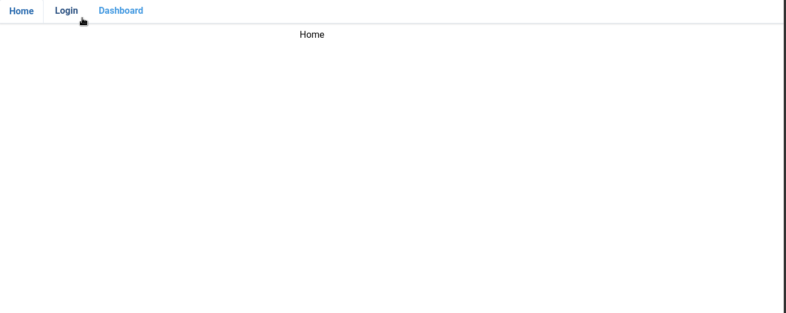

<!-- Badges -->
<p>
  
  <a href="#" target="_blank">
    
  </a>
  <a href="https://twitter.com/redacuve" target="_blank">
    
  </a>
</p>

<!-- Project Header -->
  <h1 align="center">Project Basic React Login to an external API</h1>
  <p align="center">
  <br>
   <a href="https://github.com/redacuve/login-react"><strong>Explore the repo »</strong></a>
  <br>
    <a href="https://github.com/redacuve/login-react/issues">Request Feature</a>
  </p>

<!-- TABLE OF CONTENTS -->

## Table of Contents

* [About the Project](#about-the-project)

    * [Preview](#preview)

* [Built With](#built-with)

* [Getting Started](#getting-started)

* [How it Works](#how-it-works)

* [Contributing](#contributing)

* [License](#license)

* [Contact](#contact)

<!-- ABOUT THE PROJECT -->

## About The Project

This project is a proof of concept. The user can log in to the app. The app will automatically request the API to obtain a token; if the logging is successful, the app will save the token inside the session storage for future use. The user only can access the dashboard if they previously logged in. The only public routes are home and log in. if the user previously logged in the app, He cannot access the login page; The app will redirect to the dashboard.

### Preview

<p align="center">
    
</p>

## Built With

* [React](https://reactjs.org/docs/getting-started.html)

* [HTML5](https://developer.mozilla.org/es/docs/HTML/HTML5)

* [CSS](https://developer.mozilla.org/es/docs/Web/CSS)

* [TailwindCss](https://tailwindcss.com/docs/installation)

* npm Packages used:
    * [react](https://www.npmjs.com/package/react)
    * [prop-types](https://www.npmjs.com/package/prop-types)
    * [eslint](https://www.npmjs.com/package/eslint)
    * [stylelint](https://www.npmjs.com/package/stylelint)
    * [react-hook-form](https://react-hook-form.com/get-started)

<!-- GETTING STARTED -->
## Getting Started

To get a local copy up and running follow these simple steps.

Clone or fork the <a href="https://github.com/redacuve/login-react">repo</a> [git@github.com:redacuve/Basic React Login to an external API.git]

*note you need have install npm or yarn
* [npm](https://www.npmjs.com/get-npm)
* [yarn](https://classic.yarnpkg.com/en/docs/install)
Also, you need an API that requires a token authentication on the headers of the request. It would be best if you change the const variable URL located inside the Login.js file.
|--src
  |--components
    |--Login.js


<!-- HOW IT WORKS -->
## How it Works

This project was bootstrapped with [Create React App](https://github.com/facebook/create-react-app).

This app is simple, only has three routes, home, log in, and dashboard. There are two public routes: dashboard and login, and one private route: dashboard. After the user has logged in, the app saves the token and uses it to made requests with the token inside the authentication header.

This application has the source code inside the src folder; the file structure for this project is:
* assets folder: Here are the assets like the logo and the CSS files (not a single line of CSS because everything is atomic CSS thanks to tailwindcss framework).
* components folder: Here are all of the stateless components Like errors, loading, or cards.
* index.js file: Here is where is render the application in the div with id = "root".

This mini-project is fully responsive for all types of devices: mobile, tablet, desktop, wide-desktop. It uses tailwindCss for that.

## Running the code

*   Navigate to the root directory of the project

*   Run this command on your terminal to install all of the dependecies:
    ```
    $ npm install
    ```

*   Run this command on your terminal to run the code locally on http://localhost:3000:
    ```
    $ npm start
    ```

*   Also you can build this app for production, react are going to make a build folder with minified files, and filenames with hashes for best performance
    ```
    $ npm build
    ```
*   Run this command to Lint the JS files:
    ```
    $ npx eslint .
    ```
*   Run this command to Lint the CSS/SCSS files:
    ```
    $ npx stylelint "**/*.{css,scss}"
    ```
*   You can learn more in the [Create React App Documentation](https://facebook.github.io/create-react-app/docs/getting-started).

* To learn React, check out the [React Documentation](https://reactjs.org/docs/getting-started.html).

<!-- CONTRIBUTING -->

## Contributing

Contributions are what make the open source community such an amazing place to be learn, inspire, and create. Any contributions you make are **greatly appreciated**.

1. Fork the Project

2. Create your Feature Branch (`git checkout -b feature/AmazingFeature`)

3. Commit your Changes (`git commit -m 'Add some AmazingFeature'`)

4. Push to the Branch (`git push origin feature/AmazingFeature`)

5. Open a Pull Request

<!-- LICENSE -->

## License

This project is under the <a href="https://www.gnu.org/licenses/gpl-3.0.html">GNU Public License V3</a>. For more information see <a href="https://github.com/redacuve/login-react/blob/master/LICENSE">here</a>

<!-- CONTACT -->

## Contact

Rey David Cuevas Vela - [@redacuve](https://twitter.com/redacuve) - redacuve@gmail.com -[linkedin.com/in/redacuve/](https://www.linkedin.com/in/redacuve/)

Project Link: [github.com/redacuve/login-react](https://github.com/redacuve/login-react) - Basic React Login to an external API.